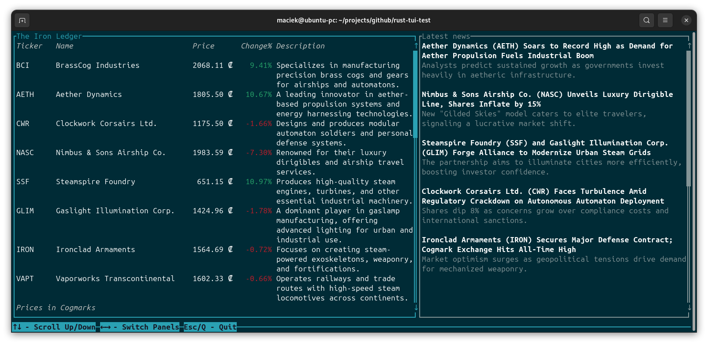

# Rust TUI Test

There is something cool yet hard to define about terminal user interfaces. I guess for my generation
it has a lot to do with the fact that we grew in an era when terminal was **the** interface - you actually
had to run an MS-DOS command to get to Windows, and it was similar under Linux - X Windows system was
optional layer on top of the system. Yet, people created amazing stuff with only access to text mode.
Just search for "Borland Turbo Vision" and you will see what I mean - there was entire industry of
commercial developers creating software that was text mode only.

This "project" is just a quick exploration of Rust and [Ratatui](https://ratatui.rs) library. I have an idea
for larger native project and I wanted to get a feel of how it feels to write Rust and whether picking it
up for the project is feasible or should I just stick to C++ (which I am not keen on for multiple reasons).

Ratatui is not something I indend to use in future but only because I do not have plans to make TUIs.
The library itself was extremely pleasant suprise. It was very easy to get _something_ on screen and then
build on top of that. I think it's only going to get better as time goes. I see tons of potential in it :)

